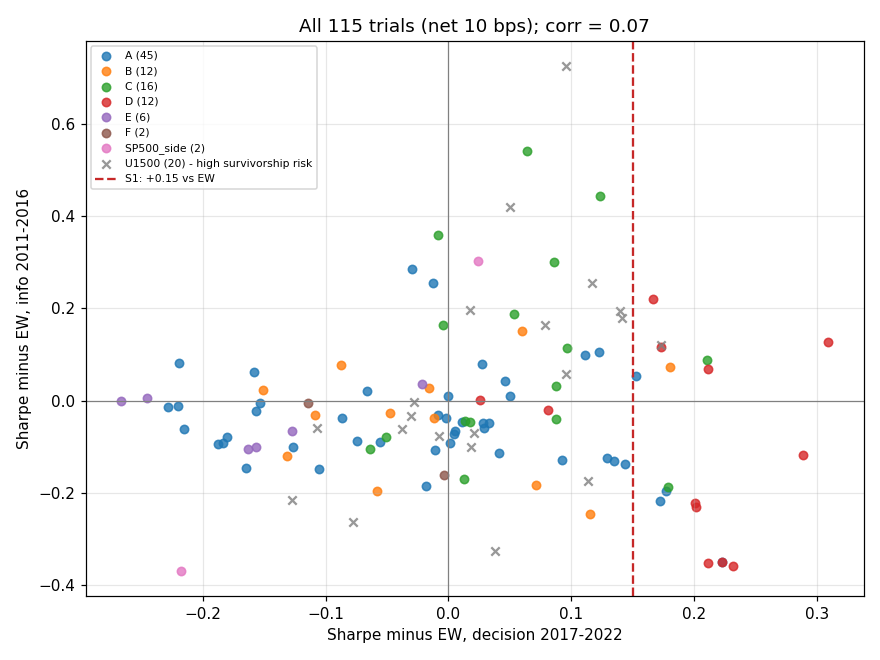

# Model A — รายงานฉบับสมบูรณ์ (AUTORUN)

> สร้างจากผลที่รันจริงทั้งหมด (`trials.csv`, `rounds/round_NNN/`) · เกณฑ์ล็อกก่อนรันใน `PREREG_AUTORUN.md` · อัปเดต 2026-09-27

## 1) คำตัดสินสั้น ๆ
**ไม่มีกฎใด "ชนะขาดรอย" — ทุกกฎอยู่ระดับ C ("ไม่ผ่าน")** จากการลอง **115 trial** ใน 6 ตระกูลไอเดีย (+ v1)
- 6 trial ผ่านเกณฑ์ผลตอบแทน S1 (ชนะ EW และ SPY ≥ 0.15 Sharpe, CAGR ≥ +2 จุด, drawdown ไม่แย่กว่า) และผ่าน S2/S6
- **แต่ไม่มีตัวไหนผ่าน S3** (Deflated Sharpe Ratio ≥ 0.95 หลังปรับจำนวนการลอง) — DSR สูงสุด ณ ปัจจุบัน (N = 93) = 0.613
- จึงไม่มีกฎที่ freeze และ **held-out (ก.ค. 2023 เป็นต้นไป) ยังไม่ถูกแตะเลย** — ยังใช้ได้สำหรับกฎในอนาคต
- ผลลบนี้ตรวจสอบได้ทุกขั้น และสอดคล้องกับงานวิจัยว่า anomaly ในหุ้นใหญ่สหรัฐอ่อนลงหลังตีพิมพ์

## 2) แผนผังสิ่งที่ลองทั้งหมด
| รอบ | ตระกูล | ลองอะไร | trial | ผู้เข้ารอบ | ใกล้สุด (Sharpe ช่วงตัดสิน) |
|---|---|---|---|---|---|
| v1 | Piotroski เดิม | BM สูง / F ≥ 7 / ทั้งคู่ + sensitivity | 12 | 0 | P2 0.634 |
| 001 | A สัญญาณเดี่ยว | 15 สัญญาณ × overall/sector + ตัวกรอง Altman/Beneish | 33 | 0 | low accruals 0.863 (DSR 0.860 ณ N=45) |
| 002 | B คะแนนรวม | QV, QMJ, QARP, F+value, shareholder yield+quality, QVI | 12 | 0 | SHY+quality 0.821 |
| 003 | C ราคา | momentum, low vol, trend, 52w high, พื้นฐาน×ราคา (รายเดือน) | 16 | 0 | SHY+quality+mom 0.824 |
| 004 | D การสร้างพอร์ต | น้ำหนัก, ความถี่, sector cap, turnover buffer (บนฐาน 2 ตัว) | 12 | 0 | low accruals cap-weight 0.929 (DSR ต่ำ) |
| 005 | E คุมความเสี่ยงตลาด | trend, vol target, drawdown stop บน SPY/EW | 6 | 0 | vol target SPY 0.592 |
| 006 | F ML baseline | GBM walk-forward, tree ลึก 2 | 2 | 0 | GBM 0.636 |
| 007 ⚠️ | universe top-1500 (เปลี่ยนหลังเห็นผล S&P 500) | 20 สเปกเดิมบน U1500 + 2 บน S&P 500 ที่ 10/25/50 bps | 22 | 0 | ROIC 0.698 (EW U1500 0.525) — **เสี่ยง survivorship สูง** |

benchmark ช่วงตัดสิน (2017–2022, net 10 bps): EW(U) รายปี 0.640 / รายเดือน 0.614 · SPY 0.681



แกนนอน = Sharpe เหนือ EW ในช่วงตัดสิน, แกนตั้ง = ในช่วงประกอบ 2011–2016 — จุดที่อยู่ขวาของเส้นแดงคือผ่านเกณฑ์ Sharpe ข้อแรกของ S1;
correlation ระหว่างสองช่วง (ทุก trial) = **−0.07** → ผลดีในช่วงหนึ่งไม่บอกอะไรเกี่ยวกับอีกช่วง

## 3) Leaderboard
ดู `LEADERBOARD.md` (สร้างอัตโนมัติ) — 10 อันดับแรกตาม Sharpe ช่วงตัดสิน:
| # | trial | Sharpe | EW | SPY | CAGR | MDD | S1 | S2 | DSR (N=93) | Sharpe 2011–16 (EW) |
|---|---|---|---|---|---|---|---|---|---|---|
| 1 | `r004_Q_LOWACC_overall_W_CAP` | 0.929 | 0.640 | 0.681 | 19.0% | -28.6% | ✅ | 95% | 0.137 | 1.020 (1.137) |
| 2 | `r004_C_SHYQMOM_overall_W_CAP` | 0.923 | 0.614 | 0.681 | 17.8% | -30.0% | ✅ | 97% | 0.087 | 1.219 (1.093) |
| 3 | `r004_Q_LOWACC_overall_BUFFER` | 0.872 | 0.640 | 0.681 | 19.0% | -34.7% | ✅ | 100% | 0.599 | 0.780 (1.137) |
| 4 | `r004_Q_LOWACC_overall_SECCAP` | 0.863 | 0.640 | 0.681 | 18.6% | -36.2% | ✅ | 100% | 0.596 | 0.787 (1.137) |
| 5 | `r001_Q_LOWACC_overall` | 0.863 | 0.640 | 0.681 | 18.6% | -36.2% | ✅ | 100% | 0.596 | 0.787 (1.137) |
| 6 | `r004_Q_LOWACC_overall_W_IV` | 0.842 | 0.640 | 0.681 | 16.9% | -35.5% | ✅ | 100% | 0.570 | 0.906 (1.137) |
| 7 | `r004_Q_LOWACC_overall_F1` | 0.837 | 0.625 | 0.681 | 18.5% | -38.6% | ❌ | 100% | 0.613 | 0.770 (1.123) |
| 8 | `r004_Q_LOWACC_overall_F2` | 0.826 | 0.625 | 0.681 | 18.8% | -38.6% | ❌ | 100% | 0.537 | 0.885 (1.108) |
| 9 | `r004_C_SHYQMOM_overall_SECCAP` | 0.825 | 0.614 | 0.681 | 15.6% | -35.0% | ❌ | 100% | 0.118 | 1.161 (1.093) |
| 10 | `r003_C_SHYQMOM_overall` | 0.824 | 0.614 | 0.681 | 15.6% | -35.0% | ❌ | 100% | 0.117 | 1.182 (1.093) |

## 4) ผู้เข้ารอบ
ไม่มี — 6 trial ที่ผ่าน S1+S2+S6 (ตก S3 ทั้งหมด):
| trial | Sharpe | CAGR (EW) | S2 | DSR (N=93) | ช่วงประกอบ Sharpe (EW) |
|---|---|---|---|---|---|
| `r001_Q_LOWACC_overall` | 0.863 | 18.6% (12.5%) | 100% | 0.596 | 0.787 (1.137) |
| `r004_Q_LOWACC_overall_W_IV` | 0.842 | 16.9% (12.5%) | 100% | 0.570 | 0.906 (1.137) |
| `r004_Q_LOWACC_overall_W_CAP` | 0.929 | 19.0% (12.5%) | 95% | 0.137 | 1.020 (1.137) |
| `r004_Q_LOWACC_overall_SECCAP` | 0.863 | 18.6% (12.5%) | 100% | 0.596 | 0.787 (1.137) |
| `r004_Q_LOWACC_overall_BUFFER` | 0.872 | 19.0% (12.5%) | 100% | 0.599 | 0.780 (1.137) |
| `r004_C_SHYQMOM_overall_W_CAP` | 0.923 | 17.8% (12.2%) | 97% | 0.087 | 1.219 (1.093) |

หมายเหตุ: `SECCAP` ได้ผลเท่าฐานทุกหลัก เพราะไม่มีกลุ่ม SIC ใดเกิน 25% ของพอร์ตในรอบใด (เงื่อนไขไม่เคยทำงาน) — ยังนับเป็น 1 trial ตามโปรโตคอล

**ทำไมกลุ่ม low accruals ไม่นับว่าชนะ:** (ก) ช่วงประกอบ 2011–2016 แพ้ EW ทุกรูปแบบ (ข) DSR < 0.95 (ค) รูปแบบที่ Sharpe สูงสุดเป็น cap-weight
ซึ่งส่วนเกินมาจากการถือหุ้นใหญ่ในยุคที่ mega-cap นำตลาด ไม่ใช่จากสัญญาณ

## 5) held-out และข้ามตลาด
- **held-out:** ไม่ถูกใช้ (ไม่มีกฎที่ freeze) — เดโม adapter ใน `export/` ก็ไม่ให้คะแนนหลัง 2023-06-30 — ล็อกทางเทคนิคใน `lib/guard.py` ตลอดการวิจัย
- **S5 ระดับ factor (อ้างอิง ไม่ได้ใช้ตัดสินเพราะไม่มีผู้เข้ารอบ; `autorun/s5_factor_reference.csv`):** HML, RMW, CMA, MOM และ combo
  ให้ค่าเฉลี่ยเป็นบวกครบ 6/6 ชุด (US 1963–2010, Developed ex US, Europe, Japan, Asia Pacific ex Japan, Emerging)
  → factor เหล่านี้ "มีอยู่จริง" ในระยะยาวและหลายตลาด แต่ในหุ้นใหญ่ S&P 500 ช่วง 2017–2022 ไม่แรงพอจะชนะขาดรอยหลังหักการลองหลายครั้ง
- **S5 ระดับดัชนี (round 005):** overlay ดีกว่า buy-and-hold 4–5 จาก 6 ดัชนีในประวัติยาว แต่แพ้ชัดเจนในช่วงตัดสิน

### round 007 — universe top-1500 (⚠️ เสี่ยง survivorship สูง — ห้ามใช้เป็นหลักฐานหลัก)
- ไม่มีรายชื่อ S&P 400/600 ย้อนหลังที่ตรวจได้ → ใช้ top 1,500 ตาม market cap แบบ PIT + ตัวกรองสภาพคล่อง
- ความครอบคลุมราคาช่วงตัดสินต่ำกว่า S&P 500 เฉลี่ย 14.2 จุด (p < 0.001 ทุกปี); บริษัทที่ออกไปแล้วมีราคาแค่ 19.5% (S&P 500: 42.7%)
- ไม่มีสเปกใดผ่าน S1 (แม้ที่ 10 bps) — รายละเอียด `rounds/round_007/RESULTS.md`; ผู้ใช้สั่งหยุดงานส่วนนี้

## 6) สิ่งที่ล้มเหลวและเหตุผล
- **value (BM, E/P, EBIT/EV, FCF)**: แพ้ EW ทุกรูปแบบในช่วง 2017–2022 (ยุคที่ growth/mega-cap นำ) — ใส่ value ในคะแนนรวมทำให้ผลแย่ลงเสมอ
- **Piotroski เดิม (v1)**: เหลือหุ้น ~13 ตัว เป็นหุ้นวัฏจักรที่แกว่งแรง (เรือสำราญขาดทุนหนักรอบ 2019, สายการบินฟื้นแรงรอบ 2020)
- **momentum / low vol เดี่ยว**: ไม่เด่นในหุ้นใหญ่ช่วงนี้; low vol ดีมากช่วง 2011–2016 แต่ไม่ต่อเนื่อง
- **overlay ตลาด**: ช่วยลด drawdown แต่ crash สั้น/ฟื้นเร็ว (2020) ทำให้ออกช้าเข้าช้า
- **ML**: ได้แค่ระดับ EW; กฎจาก tree เปลี่ยน feature หลักเกือบทุกปี → ไม่มีโครงสร้างที่เสถียรให้สกัดเป็นกฎ
- **walk-forward**: ในทุกตระกูล ตัวที่ดีที่สุดช่วงประกอบไม่ใช่ตัวที่ดีช่วงตัดสิน

## 7) ข้อจำกัดและความเสี่ยง
- **survivorship**: ราคาจาก Yahoo ไม่มีหุ้นที่ถูกซื้อ/ล้มละลายจำนวนมาก (ช่วงต้นขาด 20–31%) → ทุกผล (รวม EW) น่าจะสูงเกินจริง; เทียบ SPY/RSP เอียงเข้าข้างเรา
- **จำนวน trial**: 93 ครั้ง → เกณฑ์ S3 เข้มตามจริง; การค้นต่อจะยิ่งเข้มขึ้น
- **ช่วงตัดสินสั้น**: 72 เดือน (6 รอบรายปี) และเป็นยุคพิเศษ (mega-cap, โควิด)
- **held-out น้อย**: มีแค่ 3 รอบเต็ม — ใช้ได้แค่ตรวจทิศทาง
- **ข้อมูล**: กลุ่มอุตสาหกรรมเป็น SIC ไม่ใช่ GICS; ไม่รวมกลุ่มการเงิน; market cap อาจคลาดเคลื่อนหลังการควบรวม (ใช้จำนวนหุ้นจาก 10-K)
- **บั๊กที่พบและแก้ระหว่างทาง** (ทุกครั้งรันใหม่และบันทึก): split/market cap 3 จุด (v1), งบปีก่อนหยิบแถวว่าง, ปฏิทินวันหยุดในสัญญาณราคา,
  ค่า missing ของ Ken French — รายละเอียด `autorun/DEVIATIONS.md` และ `../experiments/log.md`

## 8) วิธีรันซ้ำ
```bash
cd model_A
python3 -m lib.build_data                 # ดาวน์โหลด/สร้างข้อมูล (SEC, fja05680, yfinance) — ใช้ cache ใน data/ (ไม่อยู่ใน git)
python3 -m rounds.round_001.run           # ... ถึง round_006 (แต่ละ round อ่าน panel จาก data/interim; สร้างใหม่อัตโนมัติถ้าไม่มี)
```
- ห้ามตั้ง `FINAL_EVAL=1` (ปลดล็อก held-out) เว้นแต่มีกฎที่ freeze ตาม `PREREG_AUTORUN.md` ข้อ 7
- ⚠️ runner จะ append แถวใน `trials.csv` — การรันซ้ำจะ error เพราะ trial_id ซ้ำ (ตั้งใจ เพื่อกันนับซ้ำ) ให้รันบนสำเนา

## 9) อภิธานศัพท์ (ภาษาง่าย)
| คำ | ความหมาย |
|---|---|
| Sharpe | ผลตอบแทนส่วนเกินต่อความเสี่ยง — ยิ่งสูงยิ่งได้กำไรต่อความผันผวนมาก |
| EW | ซื้อทุกหุ้นใน universe เท่า ๆ กัน — "ค่าเฉลี่ยของทั้งสนาม" |
| Max drawdown | ขาดทุนสะสมจากจุดสูงสุดมากที่สุด |
| point-in-time | ใช้ข้อมูลที่ "มีอยู่จริง ณ วันนั้น" เท่านั้น (วันยื่นงบจริง, ค่าที่ยื่นครั้งแรก) |
| held-out | ข้อมูลช่วงท้ายที่ล็อกไว้ ห้ามดูจนกว่าจะสรุป — เหมือนข้อสอบจริงที่ยังไม่เปิด |
| trial | การลองตั้งค่า 1 แบบบนข้อมูล — ยิ่งลองมาก โอกาสเจอผลดีโดยบังเอิญยิ่งสูง |
| DSR | Sharpe ที่ถูก "หักส่วนลด" ตามจำนวนการลอง — ต้อง ≥ 0.95 จึงเชื่อว่าไม่ใช่โชค |
| walk-forward | เลือกจากอดีต แล้วดูผลในอนาคตที่ไม่ได้ใช้เลือก |
| survivorship bias | ข้อมูลมีแต่ "ผู้รอดชีวิต" ทำให้ผลดูดีเกินจริง |
| factor (HML/RMW/CMA/MOM) | พอร์ต long-short มาตรฐานของ Ken French: มูลค่า / กำไรดี / ลงทุนน้อย / momentum |
